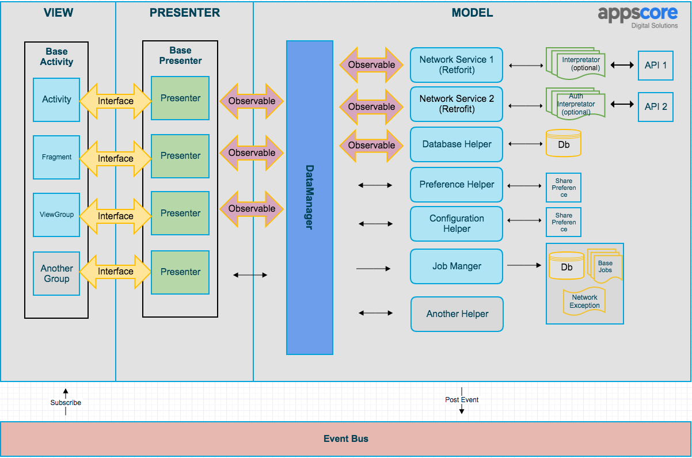

# Android-Architecture
Provides information on Android Architecture.

Libraries and tools included:

- Support libraries
- RecyclerViews 
- [RxJava](https://github.com/ReactiveX/RxJava) and [RxAndroid](https://github.com/ReactiveX/RxAndroid) 
- [Retrofit 2](http://square.github.io/retrofit/)
- [Dagger 2](http://google.github.io/dagger/)
- [DBFlow](https://github.com/Raizlabs/DBFlow)
- [Butterknife](https://github.com/JakeWharton/butterknife)
- [Timber](https://github.com/JakeWharton/timber)
- [EventBus](https://github.com/greenrobot/EventBus)
- [JobManager](https://github.com/yigit/android-priority-jobqueue)
- [PlayService](https://developers.google.com/android/guides/setup)

### How to implement a new screen following MVP

Imagine you have to implement a sign in screen. 

1. Create a new package under `ui` called `signin`
2. Create an new Activity called `ActivitySignIn`. You could also use a Fragment.
3. Define the view interface that your Activity is going to implement. Create a new interface called `SignInMvpView` that extends `MvpView`. Add the methods that you think will be necessary, e.g. `showSignInSuccessful()`
4. Create a `SignInPresenter` class that extends `BasePresenter<SignInMvpView>`
5. Implement the methods in `SignInPresenter` that your Activity requires to perform the necessary actions, e.g. `signIn(String email)`. Once the sign in action finishes you should call `getMvpView().showSignInSuccessful()`.
6. Create a `SignInPresenterTest`and write unit tests for `signIn(email)`. Remember to mock the  `SignInMvpView` and also the `DataManager`.
7. Make your  `ActivitySignIn` implement `SignInMvpView` and implement the required methods like `showSignInSuccessful()`
8. In your activity, inject a new instance of `SignInPresenter` and call `presenter.attachView(this)` from `onCreate` and `presenter.detachView()` from `onDestroy()`. Also, set up a click listener in your button that calls `presenter.signIn(email)`.

Please see the `SampleActivity` implementation.

# Architecture Guidelines

The architecture of our Android apps is based on the [MVP](https://en.wikipedia.org/wiki/Model%E2%80%93view%E2%80%93presenter) (Model View Presenter) pattern.

* __View (UI layer)__: this is where Activities, Fragments and other standard Android components live. It's responsible for displaying the data received from the presenters to the user. It also handles user interactions and inputs (click listeners, etc) and triggers the right action in the Presenter if needed.

* __Presenter__: presenters subscribe to RxJava Observables provided by the `DataManager`. They are in charge of handling the subscription lifecycle, analysing/modifying the data returned by the `DataManager` and calling the appropriate methods in the View in order to display the data.

* __Model (Data Layer)__: this is responsible for retrieving, saving, caching and massaging data. It can communicate with local databases and other data stores as well as with restful APIs or third party SDKs. It is divided in two parts: a group of helpers and a `DataManager`. The number of helpers vary between project and each of them has a very specific function, e.g. talking to an API or saving data in `SharedPreferences`. The `DataManager` combines and transforms the outputs from different helpers using Rx operators so it can: 1) provide meaningful data to the Presenter,  2) group actions that will always happen together. This layer also contains the actual model classes that define how the data structure is.



Looking at the diagram from right to left:

* __Helpers (Model)__: A set of classes, each of them with a very specific responsibility. Their function can range from talking to APIs or a database to implementing some specific business logic. Every project will have different helpers but the most common ones are:
	- __DatabaseHelper__: It handles inserting, updating and retrieving data from a local SQLite database. Its methods return Rx Observables that emit plain java objects (models)
	- __PreferencesHelper__: It saves and gets data from `SharedPreferences`, it can return Observables or plain java objects directly.
	- __Retrofit services__ : [Retrofit](http://square.github.io/retrofit) interfaces that talk to Restful APIs, each different API will have its own Retrofit service. They return Rx Observables.

* __Data Manager (Model)__: It's a key part of the architecture. It keeps a reference to every helper class and uses them to satisfy the requests coming from the presenters. Its methods make extensive use of Rx operators to combine, transform or filter the output coming from the helpers in order to generate the desired output ready for the Presenters. It returns observables that emit data models.

* __Presenters__: Subscribe to observables provided by the `DataManager` and process the data in order to call the right method in the View.

* __Activities, Fragments, ViewGroups (View)__: Standard Android components that implement a set of methods that the Presenters can call. They also handle user interactions such as clicks and act accordingly by calling the appropriate method in the Presenter. These components also implement framework-related tasks such us managing the Android lifecycle, inflating views, etc.

* __Event Bus__: It allows the View components to be notified of certain types of events that happen in the Model. Generally the  `DataManager` posts events which can then be subscribed to by Activities and Fragments. The event bus is __only used for very specific actions__ that are not related to only one screen and have a broadcasting nature, e.g. the user has signed out.

## Distribution

The project can be distributed using either [Crashlytics](http://support.crashlytics.com/knowledgebase/articles/388925-beta-distributions-with-gradle) or the [Google Play Store](https://github.com/Triple-T/gradle-play-publisher).

### Play Store

We use the __Gradle Play Publisher__ plugin. Once set up correctly, you will be able to push new builds to
the Alpha, Beta or production channels like this

```
./gradlew publishApkRelease
```
Read [plugin documentation](https://github.com/Triple-T/gradle-play-publisher) for more info.

### Crashlytics

You can also use Fabric's Crashlytics for distributing beta releases. Remember to add your fabric
account details to `app/src/fabric.properties`.

To upload a release build to Crashlytics run:

```
./gradlew assembleRelease crashlyticsUploadDistributionRelease
```

## New project setup 

To quickly start a new project from this boilerplate follow the next steps:

* Download this
* Change the package name. 
  * Rename packages in main, androidTest and test using Android Studio.
  * In `app/build.gradle` file, `packageName` and `testInstrumentationRunner`.
  * In `src/main/AndroidManifest.xml` and `src/debug/AndroidManifest.xml`.
* Create a new git repository, [see GitHub tutorial](https://help.github.com/articles/adding-an-existing-project-to-github-using-the-command-line/).
* Replace the example code with your app code following the same architecture.
* In `app/build.gradle` add the signing config to enable release versions.
* Add Fabric API key and secret to fabric.properties and uncomment Fabric plugin set up in `app/build.gradle`
* Update `proguard-rules.pro` to keep models (see TODO in file) and add extra rules to file if needed.
* Update README with information relevant to the new project.
* Update LICENSE to match the requirements of the new project.

### Sources
- Android-CleanArchitecture [click](https://github.com/android10/Android-CleanArchitecture)
- Architecting Android…The evolution [click](http://fernandocejas.com/2015/07/18/architecting-android-the-evolution/)
- Reak [click](https://github.com/reark/reark)
- Android Dev Summit 2015 [click](https://www.youtube.com/watch?v=BlkJzgjzL0c)
- Mosb [click](http://hannesdorfmann.com/mosby/)
- Approaching Android with MVVM [click](https://labs.ribot.co.uk/approaching-android-with-mvvm-8ceec02d5442#.x49fpvrh7)
- Ribot [click](https://labs.ribot.co.uk/android-application-architecture-8b6e34acda65#.8yfra7ozv)


        