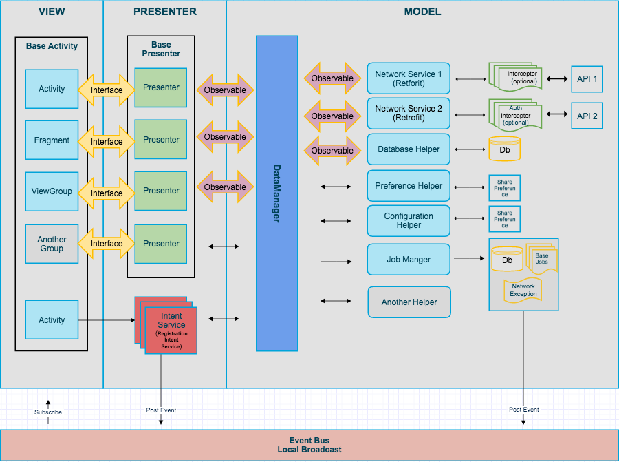

# Android-Architecture
Provides information on Android Architecture.

Libraries and tools included:

- Support libraries
- RecyclerViews 
- [RxJava](https://github.com/ReactiveX/RxJava) and [RxAndroid](https://github.com/ReactiveX/RxAndroid) 
- [Retrofit 2](http://square.github.io/retrofit/)
- [Dagger 2](http://google.github.io/dagger/)
- [SqlBrite](https://github.com/square/sqlbrite)
- [Butterknife](https://github.com/JakeWharton/butterknife)
- [Timber](https://github.com/JakeWharton/timber)
- [EventBus](https://github.com/greenrobot/EventBus)

## Architecture
   This project follows Android architecture guidelines that are based on [MVP (Model View Presenter)](https://www.wikiwand.com/en/Model%E2%80%93view%E2%80%93presenter). 

### How to implement a new screen following MVP

Imagine you have to implement a sign in screen. 

1. Create a new package under `ui` called `signin`
2. Create an new Activity called `ActivitySignIn`. You could also use a Fragment.
3. Define the view interface that your Activity is going to implement. Create a new interface called `SignInMvpView` that extends `MvpView`. Add the methods that you think will be necessary, e.g. `showSignInSuccessful()`
4. Create a `SignInPresenter` class that extends `BasePresenter<SignInMvpView>`
5. Implement the methods in `SignInPresenter` that your Activity requires to perform the necessary actions, e.g. `signIn(String email)`. Once the sign in action finishes you should call `getMvpView().showSignInSuccessful()`.
6. Create a `SignInPresenterTest`and write unit tests for `signIn(email)`. Remember to mock the  `SignInMvpView` and also the `DataManager`.
7. Make your  `ActivitySignIn` implement `SignInMvpView` and implement the required methods like `showSignInSuccessful()`
8. In your activity, inject a new instance of `SignInPresenter` and call `presenter.attachView(this)` from `onCreate` and `presenter.detachView()` from `onDestroy()`. Also, set up a click listener in your button that calls `presenter.signIn(email)`.

Please see the `SampleActivity` implementation.

        